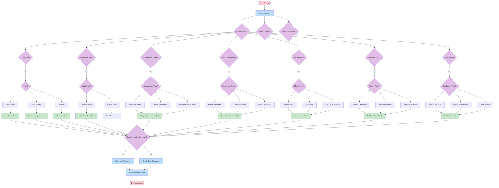
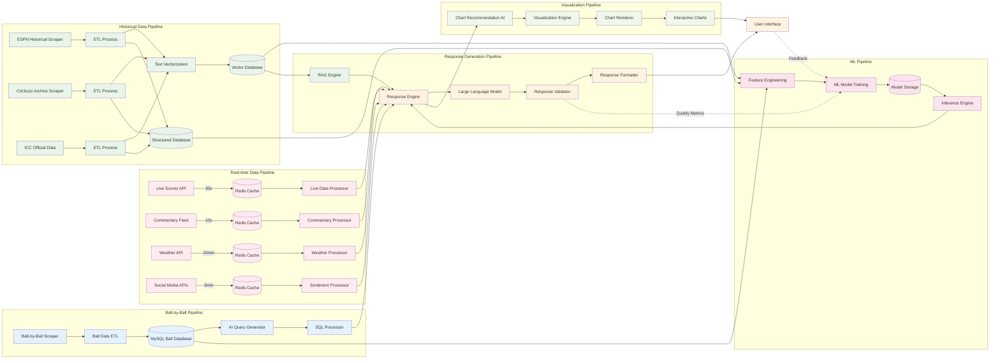
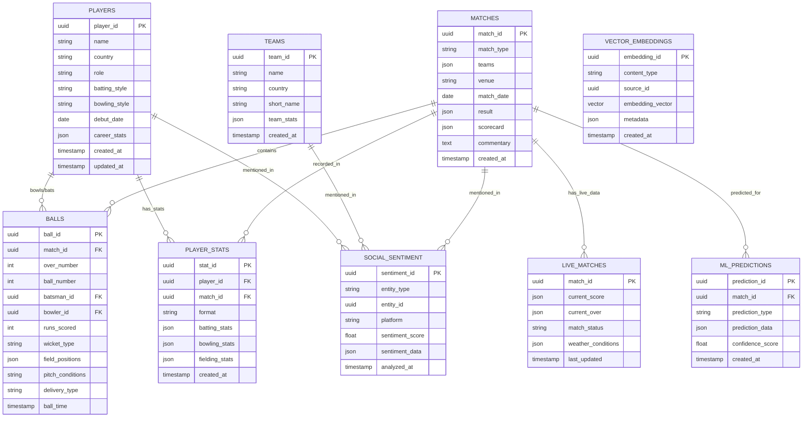
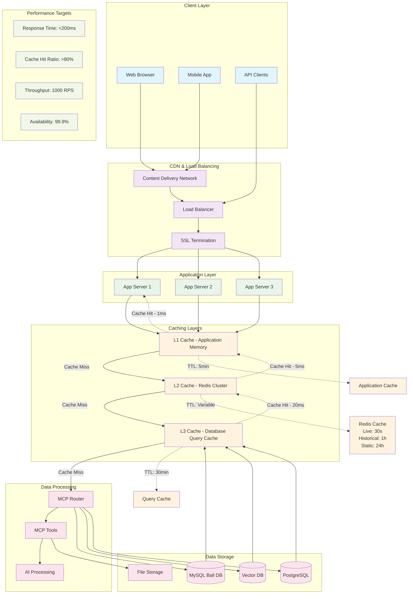

```mermaid
graph TB
    subgraph "User Interface Layer"
        UI[User Interface]
        Voice[Voice Input]
        Text[Text Input]
        Image[Image Input]
    end
    
    subgraph "Query Processing Engine"
        QP[Query Processor]
        IC[Intent Classifier]
        NER[Entity Recognition]
        TC[Temporal Context]
        QC[Query Complexity Analyzer]
    end
    
    subgraph "MCP Intelligent Router"
        Router[MCP Router]
        DM[Decision Matrix]
        TM[Tool Mapper]
    end
    
    subgraph "MCP Tools Layer"
        subgraph "Core Tools"
            LST[Live Score Tool]
            HST[Historical Stats Tool] 
            CST[Commentary Scraper Tool]
            WT[Weather Tool]
            PT[Prediction Tool]
        end
        
        subgraph "Advanced Tools"
            BDT[Ball Database Tool]
            PCT[Player Comparison Tool]
            SST[Social Sentiment Tool]
            VT[Visualization Tool]
        end
    end
    
    subgraph "Data Sources & Processing"
        subgraph "Live Data Sources"
            ESPN[ESPNCricinfo API]
            CB[Cricbuzz API]
            Weather[Weather APIs]
            Social[Social Media APIs]
        end
        
        subgraph "Historical Data Sources"
            MySQL[(MySQL Ball Database)]
            VectorDB[(Vector Database - RAG)]
            PlayerDB[(Player Database)]
            MatchDB[(Match Database)]
        end
        
        subgraph "ML & AI Models"
            LLM[Large Language Model]
            MLModels[ML Prediction Models]
            SentimentAI[Sentiment Analysis AI]
            ChartAI[Chart Recommendation AI]
        end
    end
    
    subgraph "Response Generation"
        RG[Response Generator]
        VA[Response Validator]
        VIZ[Visualization Generator]
        Formatter[Response Formatter]
    end
    
    subgraph "Caching & Optimization"
        Redis[(Redis Cache)]
        CDN[Content Delivery Network]
        LoadBalancer[Load Balancer]
    end
    
    %% User Flow
    UI --> QP
    Voice --> QP
    Text --> QP
    Image --> QP
    
    %% Query Processing Flow
    QP --> IC
    QP --> NER
    QP --> TC
    QP --> QC
    
    %% Routing Flow
    IC --> Router
    NER --> Router
    TC --> Router
    QC --> Router
    
    Router --> DM
    DM --> TM
    
    %% Tool Selection
    TM --> LST
    TM --> HST
    TM --> CST
    TM --> WT
    TM --> PT
    TM --> BDT
    TM --> PCT
    TM --> SST
    TM --> VT
    
    %% Data Source Connections
    LST --> ESPN
    LST --> CB
    CST --> ESPN
    CST --> CB
    WT --> Weather
    SST --> Social
    
    HST --> VectorDB
    BDT --> MySQL
    PCT --> PlayerDB
    PCT --> MatchDB
    
    %% AI/ML Connections
    BDT --> LLM
    PCT --> MLModels
    SST --> SentimentAI
    VT --> ChartAI
    PT --> MLModels
    
    %% Response Generation
    LST --> RG
    HST --> RG
    CST --> RG
    WT --> RG
    PT --> RG
    BDT --> RG
    PCT --> RG
    SST --> RG
    VT --> VIZ
    
    RG --> VA
    VA --> Formatter
    VIZ --> Formatter
    
    %% Caching
    Router --> Redis
    ESPN --> Redis
    CB --> Redis
    Weather --> Redis
    Social --> Redis
    
    %% Load Balancing
    LoadBalancer --> QP
    CDN --> UI
    
    %% Final Output
    Formatter --> UI
    
    %% Styling
    classDef userLayer fill:#e1f5fe
    classDef processingLayer fill:#f3e5f5
    classDef toolsLayer fill:#e8f5e8
    classDef dataLayer fill:#fff3e0
    classDef aiLayer fill:#fce4ec
    classDef cacheLayer fill:#f1f8e9
    
    class UI,Voice,Text,Image userLayer
    class QP,IC,NER,TC,QC,Router,DM,TM processingLayer
    class LST,HST,CST,WT,PT,BDT,PCT,SST,VT toolsLayer
    class ESPN,CB,Weather,Social,MySQL,VectorDB,PlayerDB,MatchDB dataLayer
    class LLM,MLModels,SentimentAI,ChartAI aiLayer
    class Redis,CDN,LoadBalancer cacheLayer
```

## 3. Data Flow Architecture







```mermaid
graph TD
    subgraph "Query Types"
        Q1[Live Match Query]
        Q2[Historical Stats Query]
        Q3[Player Comparison Query]
        Q4[Ball Analysis Query]
        Q5[Sentiment Query]
        Q6[Prediction Query]
        Q7[Visualization Query]
    end
    
    subgraph "Tool Combinations"
        T1[Single Tool Response]
        T2[Live + Weather]
        T3[Historical + Comparison]
        T4[Ball DB + Visualization]
        T5[Sentiment + Prediction]
        T6[Multi-source Analysis]
    end
    
    subgraph "Response Types"
        R1[Text Response]
        R2[Data Tables]
        R3[Interactive Charts]
        R4[Sentiment Dashboard]
        R5[Prediction Report]
        R6[Comparison Analysis]
    end
    
    %% Query to Tool mapping
    Q1 --> T1
    Q1 --> T2
    Q2 --> T1
    Q2 --> T3
    Q3 --> T3
    Q3 --> T6
    Q4 --> T1
    Q4 --> T4
    Q5 --> T1
    Q5 --> T5
    Q6 --> T5
    Q6 --> T6
    Q7 --> T4
    Q7 --> T6
    
    %% Tool to Response mapping
    T1 --> R1
    T1 --> R2
    T2 --> R1
    T2 --> R2
    T3 --> R6
    T3 --> R3
    T4 --> R3
    T4 --> R2
    T5 --> R4
    T5 --> R5
    T6 --> R3
    T6 --> R5
    T6 --> R6
    
    %% Examples
    Q1 -.->|Example: "Current score of IND vs AUS"| T2
    Q2 -.->|Example: "Kohli's career average"| T1
    Q3 -.->|Example: "Compare Bumrah vs Starc"| T3
    Q4 -.->|Example: "Yorkers in death overs"| T4
    Q5 -.->|Example: "Fan reaction to selection"| T1
    Q6 -.->|Example: "Who will win today?"| T5
    Q7 -.->|Example: "Show batting trends"| T4
    
    %% Styling
    classDef query fill:#e1f5fe
    classDef tool fill:#e8f5e8
    classDef response fill:#fff3e0
    
    class Q1,Q2,Q3,Q4,Q5,Q6,Q7 query
    class T1,T2,T3,T4,T5,T6 tool
    class R1,R2,R3,R4,R5,R6 response
```




These comprehensive Mermaid diagrams show the complete architecture, data flows, tool interactions, database relationships, and performance optimization strategies for your cricket chatbot system.