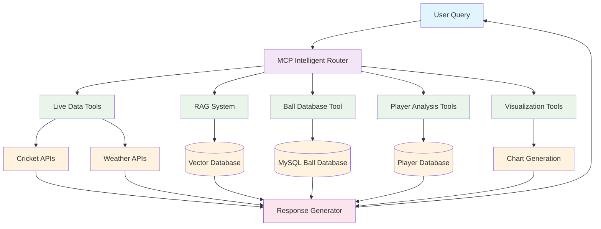
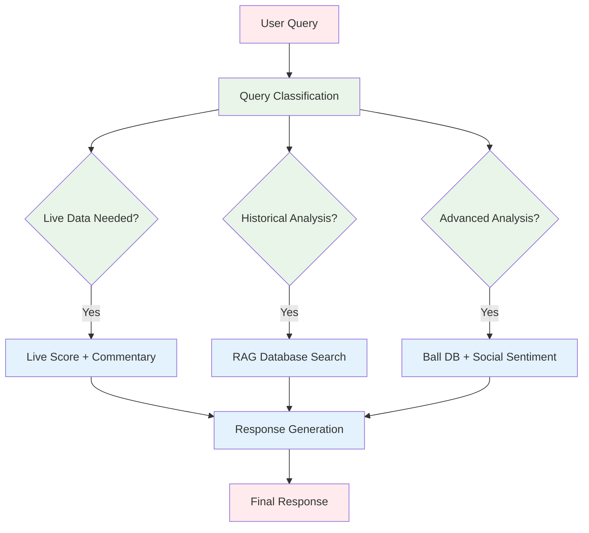
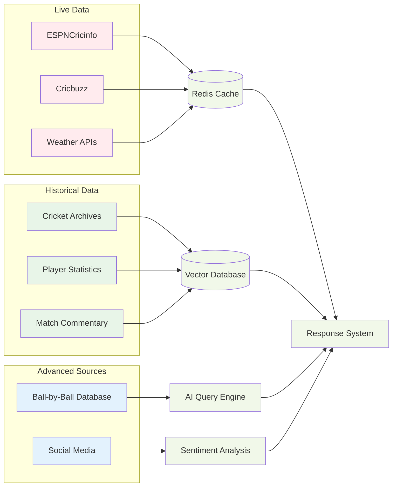
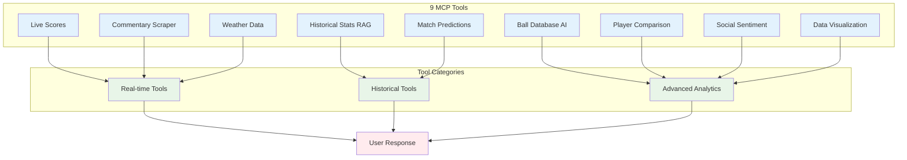
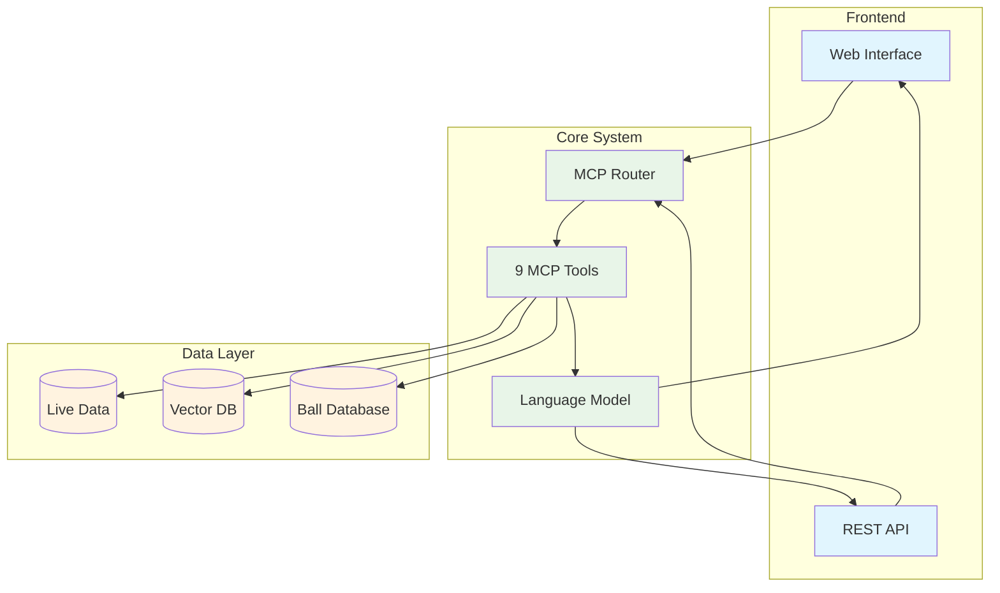
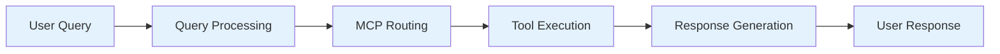

# Cricket Chatbot - Simplified Architecture for Presentation

## 1. High-Level System Overview

## 2. MCP Tool Decision Logic

## 3. Data Sources and Flow

## 4. Core MCP Tools

## 5. System Architecture Components

## 6. Query Processing Flow

These simplified diagrams focus on the key concepts and flow without overwhelming detail, perfect for a professor presentation!