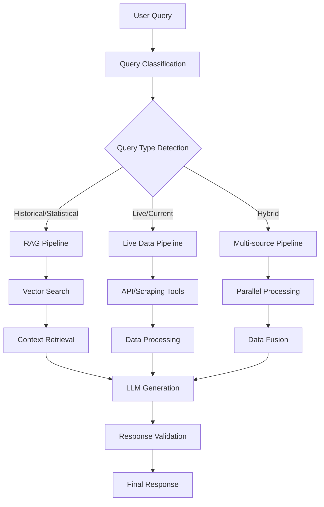

# Cricket Chatbot Technical Documentation
## RAG-Based Chatbot with MCP Tools Integration

### Executive Summary
This document outlines the technical architecture for a comprehensive cricket chatbot that combines Retrieval Augmented Generation (RAG) with Model Context Protocol (MCP) tools for intelligent routing between historical data retrieval and live data scraping.

---

## 1. System Architecture Overview

### Core Components
```
┌─────────────────────────────────────────────────────────────┐
│                    Cricket Chatbot System                   │
├─────────────────────────────────────────────────────────────┤
│  ┌─────────────┐  ┌─────────────┐  ┌─────────────────────┐  │
│  │   User      │  │   Query     │  │   Response          │  │
│  │  Interface  │◄─┤ Processing  ├─►│   Generation        │  │
│  └─────────────┘  └─────┬───────┘  └─────────────────────┘  │
│                         │                                   │
│  ┌─────────────────────┴─────────────────────────────────┐  │
│  │            Intelligent Router (MCP)                   │  │
│  └─────────┬───────────────────────────┬─────────────────┘  │
│            │                           │                    │
│  ┌─────────▼─────────┐       ┌─────────▼─────────────────┐  │
│  │   RAG System      │       │   Live Data Scraper      │  │
│  │ (Historical Data) │       │   (Real-time Data)       │  │
│  └───────────────────┘       └───────────────────────────┘  │
└─────────────────────────────────────────────────────────────┘
```

### Technology Stack
- **Backend Framework**: FastAPI/Django
- **Vector Database**: Pinecone/Weaviate/ChromaDB
- **LLM Integration**: OpenAI GPT-4/Claude/Local LLM
- **MCP Framework**: Model Context Protocol
- **Data Processing**: Pandas, NumPy, BeautifulSoup
- **Real-time Data**: WebSocket connections, REST APIs
- **Database**: PostgreSQL/MongoDB for structured data
- **Caching**: Redis for frequently accessed data

---

## 2. Data Flow Architecture

### 2.1 Query Processing Pipeline



### 2.2 Decision Tree for Data Source Selection

```
Query Analysis
├── Intent Classification
│   ├── Historical Stats (>24h old)
│   │   ├── Player Career Stats → RAG Database
│   │   ├── Team Performance History → RAG Database
│   │   └── Match Archives → RAG Database
│   ├── Live/Current Data (<24h)
│   │   ├── Live Scores → ESPNCricinfo API
│   │   ├── Current Match Commentary → Live Scraping
│   │   ├── Player Current Form → Hybrid (RAG + Live)
│   │   └── Weather/Pitch Conditions → Weather APIs
│   └── Predictive/Analysis
│       ├── Match Predictions → ML Models + RAG
│       ├── Player Comparisons → RAG Database
│       └── Trend Analysis → RAG + Live Data
```

---

## 3. RAG Implementation Strategy

### 3.1 Data Ingestion Pipeline

```python
# Conceptual Data Flow
Raw Cricket Data Sources
├── ESPNCricinfo Historical Data
├── Cricbuzz Archives
├── ICC Official Statistics
├── Player Biographies
├── Match Reports
├── Commentary Archives
└── Statistical Records

↓ Data Processing

Structured Data Store
├── Player Profiles
├── Match Results
├── Team Statistics
├── Venue Information
├── Tournament Data
└── Performance Metrics

↓ Vectorization

Vector Database
├── Semantic Search Capability
├── Multi-modal Embeddings
├── Contextual Relationships
└── Fast Retrieval System
```

### 3.2 Document Chunking Strategy

```
Document Types & Chunking Approach:
├── Match Commentary
│   ├── Chunk by Over (6 balls)
│   ├── Chunk by Innings
│   └── Chunk by Key Events
├── Player Statistics
│   ├── Chunk by Season/Year
│   ├── Chunk by Format (Test/ODI/T20)
│   └── Chunk by Opposition
├── Match Reports
│   ├── Chunk by Sections (Summary, Analysis, Key Moments)
│   ├── Semantic Chunking for Coherent Passages
│   └── Overlap Strategy for Context Preservation
└── Historical Records
    ├── Chunk by Time Periods
    ├── Chunk by Achievement Categories
    └── Chunk by Statistical Milestones
```

### 3.3 Embedding Strategy

```
Multi-level Embedding Approach:
├── Document-level Embeddings
│   ├── Match Summary Embeddings
│   ├── Player Profile Embeddings
│   └── Team Performance Embeddings
├── Chunk-level Embeddings
│   ├── Specific Statistics
│   ├── Commentary Segments
│   └── Analysis Snippets
└── Metadata Embeddings
    ├── Temporal Information
    ├── Contextual Tags
    └── Performance Metrics
```

---

## 4. MCP Tools Integration

### 4.1 MCP Tool Definitions

```json
{
  "cricket_tools": {
    "live_score_tool": {
      "name": "get_live_scores",
      "description": "Fetches current live cricket scores",
      "trigger_conditions": ["live", "current", "ongoing", "now"],
      "data_sources": ["ESPNCricinfo API", "Cricbuzz API"],
      "cache_duration": "30_seconds"
    },
    "historical_stats_tool": {
      "name": "query_historical_data",
      "description": "Retrieves historical cricket statistics",
      "trigger_conditions": ["career", "history", "record", "all-time"],
      "data_sources": ["RAG Vector Database"],
      "cache_duration": "1_hour"
    },
    "commentary_scraper_tool": {
      "name": "scrape_live_commentary",
      "description": "Scrapes real-time match commentary",
      "trigger_conditions": ["commentary", "ball-by-ball", "live updates"],
      "data_sources": ["ESPNCricinfo", "Cricbuzz"],
      "cache_duration": "10_seconds"
    },
    "weather_tool": {
      "name": "get_weather_conditions",
      "description": "Fetches weather data for cricket venues",
      "trigger_conditions": ["weather", "conditions", "rain", "temperature"],
      "data_sources": ["OpenWeatherMap API", "AccuWeather API"],
      "cache_duration": "10_minutes"
    },
    "prediction_tool": {
      "name": "generate_predictions",
      "description": "ML-based cricket match predictions",
      "trigger_conditions": ["predict", "forecast", "who will win"],
      "data_sources": ["ML Models", "RAG Database", "Live Data"],
      "cache_duration": "5_minutes"
    },
    "ball_database_tool": {
      "name": "query_ball_database",
      "description": "AI-powered MySQL queries for every ball bowled in cricket history",
      "trigger_conditions": ["specific stats", "ball analysis", "delivery patterns", "bowling stats"],
      "data_sources": ["MySQL Ball Database", "AI Query Generator"],
      "cache_duration": "2_hours",
      "features": {
        "natural_language_sql": true,
        "query_optimization": true,
        "result_aggregation": true,
        "statistical_analysis": true
      }
    },
    "player_comparison_tool": {
      "name": "advanced_player_comparison",
      "description": "Deep statistical comparison between players with ML insights",
      "trigger_conditions": ["compare", "vs", "better than", "similar to"],
      "data_sources": ["Player Database", "Performance ML Models", "Situational Stats"],
      "cache_duration": "30_minutes",
      "features": {
        "multi_dimensional_analysis": true,
        "situational_comparison": true,
        "peak_form_analysis": true,
        "head_to_head_detailed": true
      }
    },
    "social_sentiment_tool": {
      "name": "cricket_social_sentiment",
      "description": "Real-time social media sentiment analysis for players/teams/matches",
      "trigger_conditions": ["popularity", "sentiment", "social media", "fan opinion"],
      "data_sources": ["Twitter API", "Reddit API", "Facebook API", "News Sentiment"],
      "cache_duration": "5_minutes",
      "features": {
        "real_time_sentiment": true,
        "trend_analysis": true,
        "controversy_detection": true,
        "fan_engagement_metrics": true
      }
    },
    "visualization_tool": {
      "name": "cricket_data_visualizer",
      "description": "Dynamic cricket data visualization and chart generation",
      "trigger_conditions": ["chart", "graph", "visualize", "show trends"],
      "data_sources": ["All Database Sources", "Real-time Data", "Historical Data"],
      "cache_duration": "15_minutes",
      "features": {
        "interactive_charts": true,
        "performance_heatmaps": true,
        "trend_visualization": true,
        "comparison_charts": true,
        "match_situation_plots": true
      }
    }
  }
}
```

### 4.2 Intelligent Routing Logic

```python
# Pseudo-code for MCP Router
class CricketChatbotRouter:
    def route_query(self, user_query):
        # 1. Query Analysis
        intent = self.classify_intent(user_query)
        entities = self.extract_entities(user_query)
        temporal_context = self.extract_temporal_markers(user_query)
        
        # 2. Decision Matrix
        if temporal_context.is_live_request():
            if intent == "scores":
                return self.tools.live_score_tool
            elif intent == "commentary":
                return self.tools.commentary_scraper_tool
            elif intent == "conditions":
                return self.tools.weather_tool
        
        elif temporal_context.is_historical():
            if intent in ["stats", "records", "career"]:
                return self.tools.historical_stats_tool
        
        elif intent == "prediction":
            return self.tools.prediction_tool
        
        # 3. Hybrid Approach
        if intent.requires_multiple_sources():
            return self.orchestrate_multi_tool_response(user_query)
        
        # 4. Default to RAG
        return self.tools.historical_stats_tool
```

---

## 4.3 Advanced MCP Tools Implementation Details

### 4.3.1 Ball Database Tool (MySQL AI Query System)

```python
class BallDatabaseTool:
    """
    AI-powered natural language to SQL converter for cricket ball database
    
    Database Schema:
    - balls: ball_id, match_id, over_number, ball_number, batsman_id, bowler_id,
             runs_scored, wicket_type, field_positions, pitch_conditions, etc.
    - matches: match_id, teams, venue, date, format, conditions
    - players: player_id, name, role, country, career_stats
    """
    
    def __init__(self):
        self.mysql_connection = MySQLConnection()
        self.query_ai = OpenAI(model="gpt-4-turbo")
        self.query_cache = QueryCache()
    
    async def process_natural_query(self, user_query: str) -> Dict:
        """
        Example queries:
        - "How many yorkers has Bumrah bowled in death overs?"
        - "What's Kohli's average against spin in Test matches?"
        - "Show me all sixes hit in the last over of ODI matches"
        """
        
        # Generate SQL from natural language
        sql_query = await self.generate_sql(user_query)
        
        # Execute with safety checks
        results = await self.execute_safe_query(sql_query)
        
        # AI-powered result interpretation
        insights = await self.interpret_results(results, user_query)
        
        return {
            "data": results,
            "insights": insights,
            "sql_used": sql_query,
            "execution_time": self.execution_time
        }
    
    async def generate_sql(self, query: str) -> str:
        """Convert natural language to optimized SQL"""
        schema_context = self.get_schema_context()
        
        prompt = f"""
        Convert this cricket query to SQL:
        Query: {query}
        
        Database Schema: {schema_context}
        
        Guidelines:
        - Use appropriate indexes
        - Limit results for performance
        - Include relevant JOINs
        - Add proper WHERE clauses
        """
        
        response = await self.query_ai.complete(prompt)
        return self.validate_and_optimize_sql(response)
```

### 4.3.2 Advanced Player Comparison Tool

```python
class PlayerComparisonTool:
    """
    Multi-dimensional player comparison with ML insights
    """
    
    def __init__(self):
        self.ml_models = {
            'performance_predictor': PerformanceMLModel(),
            'situational_analyzer': SituationalMLModel(),
            'peak_form_detector': PeakFormMLModel()
        }
    
    async def compare_players(self, player1: str, player2: str, context: Dict) -> Dict:
        """
        Comprehensive player comparison including:
        - Statistical comparison across formats
        - Situational performance (pressure, conditions)
        - Peak form periods analysis
        - Head-to-head records
        - ML-based future performance prediction
        """
        
        comparison_data = {
            'basic_stats': await self.get_basic_comparison(player1, player2),
            'situational_analysis': await self.analyze_situational_performance(player1, player2),
            'peak_form_analysis': await self.analyze_peak_periods(player1, player2),
            'head_to_head': await self.get_head_to_head_data(player1, player2),
            'ml_insights': await self.generate_ml_insights(player1, player2),
            'career_trajectory': await self.analyze_career_trends(player1, player2)
        }
        
        return comparison_data
    
    async def analyze_situational_performance(self, p1: str, p2: str) -> Dict:
        """
        Compare performance in different situations:
        - Pressure situations (final overs, chase scenarios)
        - Different conditions (home/away, pitch types)
        - Against specific opposition types
        - In different phases of the game
        """
        situations = [
            'pressure_situations', 'home_vs_away', 'vs_pace_vs_spin',
            'powerplay_performance', 'death_overs', 'run_chases'
        ]
        
        results = {}
        for situation in situations:
            results[situation] = await self.compare_in_situation(p1, p2, situation)
        
        return results
```

### 4.3.3 Social Sentiment Analysis Tool

```python
class SocialSentimentTool:
    """
    Real-time social media sentiment analysis for cricket entities
    """
    
    def __init__(self):
        self.social_apis = {
            'twitter': TwitterAPIv2(),
            'reddit': RedditAPI(),
            'facebook': FacebookGraphAPI(),
            'instagram': InstagramAPI()
        }
        self.sentiment_analyzer = SentimentAnalysisModel()
        self.trend_detector = TrendAnalysisModel()
    
    async def analyze_sentiment(self, entity: str, entity_type: str) -> Dict:
        """
        Analyze sentiment for:
        - Players: popularity, performance reactions, controversies
        - Teams: fan support, criticism, expectations
        - Matches: excitement levels, predictions, reactions
        - Events: tournament sentiment, specific incidents
        """
        
        # Collect social media data
        social_data = await self.collect_social_mentions(entity, entity_type)
        
        # Perform sentiment analysis
        sentiment_results = await self.analyze_sentiment_data(social_data)
        
        # Detect trends and patterns
        trends = await self.detect_sentiment_trends(sentiment_results)
        
        # Generate insights
        insights = await self.generate_sentiment_insights(sentiment_results, trends)
        
        return {
            'overall_sentiment': sentiment_results['overall'],
            'platform_breakdown': sentiment_results['by_platform'],
            'trending_topics': trends['topics'],
            'sentiment_timeline': trends['timeline'],
            'key_insights': insights,
            'controversy_alerts': sentiment_results['controversies']
        }
    
    async def collect_social_mentions(self, entity: str, entity_type: str) -> Dict:
        """Collect mentions from multiple social platforms"""
        search_terms = self.generate_search_terms(entity, entity_type)
        
        tasks = [
            self.search_twitter(search_terms),
            self.search_reddit(search_terms),
            self.search_facebook(search_terms),
            self.search_instagram(search_terms)
        ]
        
        results = await asyncio.gather(*tasks, return_exceptions=True)
        return self.merge_social_data(results)
```

### 4.3.4 Data Visualization Tool

```python
class CricketVisualizationTool:
    """
    Dynamic cricket data visualization generator
    """
    
    def __init__(self):
        self.chart_generators = {
            'plotly': PlotlyGenerator(),
            'matplotlib': MatplotlibGenerator(),
            'altair': AltairGenerator()
        }
        self.chart_ai = ChartRecommendationAI()
    
    async def create_visualization(self, data: Dict, viz_request: str) -> Dict:
        """
        Create visualizations based on natural language requests:
        - "Show Kohli's performance trend over the last 2 years"
        - "Compare bowling figures of fast bowlers in this match"
        - "Create a heatmap of scoring areas for this batsman"
        """
        
        # AI recommends best chart type
        chart_recommendation = await self.chart_ai.recommend_chart(data, viz_request)
        
        # Generate visualization
        chart = await self.generate_chart(data, chart_recommendation)
        
        # Add interactive features
        interactive_chart = await self.add_interactivity(chart, chart_recommendation)
        
        return {
            'chart_html': interactive_chart['html'],
            'chart_config': interactive_chart['config'],
            'chart_type': chart_recommendation['type'],
            'insights': chart_recommendation['insights'],
            'export_options': ['png', 'svg', 'pdf', 'interactive_html']
        }
    
    async def generate_performance_heatmap(self, player_id: str, match_conditions: Dict) -> Dict:
        """Generate performance heatmaps for specific conditions"""
        pass
    
    async def create_match_situation_plot(self, match_id: str, situation_type: str) -> Dict:
        """Create dynamic match situation visualizations"""
        pass
```

### 4.3.5 Enhanced Routing Logic for New Tools

```python
# Updated routing logic including new tools
class EnhancedCricketRouter:
    def route_query(self, user_query: str, context: Dict) -> List[str]:
        """Enhanced routing with new MCP tools"""
        
        intent = self.classify_intent(user_query)
        entities = self.extract_entities(user_query)
        complexity = self.assess_query_complexity(user_query)
        
        tools_to_use = []
        
        # Ball-level analysis queries
        if self.requires_ball_level_data(user_query):
            tools_to_use.append('ball_database_tool')
        
        # Player comparison requests
        if self.is_comparison_query(user_query):
            tools_to_use.append('player_comparison_tool')
        
        # Sentiment analysis requests
        if self.requires_sentiment_analysis(user_query):
            tools_to_use.append('social_sentiment_tool')
        
        # Visualization requests
        if self.requires_visualization(user_query):
            tools_to_use.append('visualization_tool')
        
        # Combine with existing tools as needed
        if self.requires_live_data(user_query):
            tools_to_use.extend(['live_score_tool', 'commentary_scraper_tool'])
        
        if self.requires_historical_context(user_query):
            tools_to_use.append('historical_stats_tool')
        
        return tools_to_use
    
    def requires_ball_level_data(self, query: str) -> bool:
        """Check if query needs ball-by-ball database access"""
        indicators = [
            'specific delivery', 'ball-by-ball', 'yorkers', 'bouncers',
            'specific over', 'delivery analysis', 'bowling patterns'
        ]
        return any(indicator in query.lower() for indicator in indicators)
    
    def is_comparison_query(self, query: str) -> bool:
        """Detect player/team comparison requests"""
        comparison_words = ['vs', 'compare', 'better than', 'difference between']
        return any(word in query.lower() for word in comparison_words)
```

---

## 5. Data Scraping Architecture

### 5.1 Multi-source Data Collection

```
Data Sources Hierarchy:
├── Primary Sources (Real-time)
│   ├── ESPNCricinfo
│   │   ├── Live Scores API
│   │   ├── Commentary Feed
│   │   ├── Player Statistics
│   │   └── Match Center Data
│   ├── Cricbuzz
│   │   ├── Live Match Data
│   │   ├── News Articles
│   │   ├── Player Profiles
│   │   └── Tournament Information
│   └── ICC Official
│       ├── Rankings
│       ├── Tournament Data
│       └── Official Statistics
├── Secondary Sources (Enrichment)
│   ├── Cricket Websites
│   ├── Social Media Feeds
│   ├── News Aggregators
│   └── Fan Forums
└── Specialized Sources
    ├── Weather APIs
    ├── Venue Information
    ├── Historical Archives
    └── Statistical Databases
```

### 5.2 Scraping Strategy

```python
# Data Scraping Framework
class CricketDataScraper:
    def __init__(self):
        self.scrapers = {
            'espncricinfo': ESPNCricinfoScraper(),
            'cricbuzz': CricbuzzScraper(),
            'icc': ICCScraper(),
            'weather': WeatherAPIScraper()
        }
        self.rate_limiters = RateLimiterManager()
        self.cache = RedisCache()
    
    async def scrape_live_data(self, data_type, match_id=None):
        # Rate limiting and caching logic
        cache_key = f"{data_type}:{match_id}"
        if cached_data := self.cache.get(cache_key):
            return cached_data
        
        # Parallel scraping with fallbacks
        tasks = []
        for scraper_name, scraper in self.scrapers.items():
            if scraper.supports(data_type):
                tasks.append(scraper.fetch(data_type, match_id))
        
        results = await asyncio.gather(*tasks, return_exceptions=True)
        
        # Data fusion and validation
        cleaned_data = self.fuse_and_validate(results)
        self.cache.set(cache_key, cleaned_data, ttl=self.get_ttl(data_type))
        
        return cleaned_data
```

### 5.3 Data Types and Structures

```
Scraped Data Categories:
├── Live Match Data
│   ├── Current Score
│   │   ├── Team Scores
│   │   ├── Individual Batsman Stats
│   │   ├── Bowler Figures
│   │   └── Partnership Details
│   ├── Ball-by-Ball Commentary
│   │   ├── Delivery Description
│   │   ├── Runs Scored
│   │   ├── Wickets Fallen
│   │   └── Commentary Notes
│   └── Match Status
│       ├── Current Over
│       ├── Required Run Rate
│       ├── Match State
│       └── Weather Conditions
├── Player Information
│   ├── Current Form
│   │   ├── Recent Match Performance
│   │   ├── Season Statistics
│   │   └── Format-specific Stats
│   ├── Career Statistics
│   │   ├── Batting Averages
│   │   ├── Bowling Figures
│   │   ├── Fielding Records
│   │   └── Milestone Achievements
│   └── Personal Information
│       ├── Biography
│       ├── Playing Style
│       └── Career Highlights
├── Team Data
│   ├── Squad Information
│   ├── Team Rankings
│   ├── Head-to-Head Records
│   └── Performance Trends
└── Tournament Information
    ├── Fixture Lists
    ├── Points Tables
    ├── Tournament Statistics
    └── Historical Results
```

---

## 6. System Flow Diagrams

### 6.1 User Interaction Flow

```
User Query Processing:
1. Query Input
   ├── Text Input
   ├── Voice Input (Future)
   └── Image Input (Scorecards, etc.)

2. Preprocessing
   ├── Intent Classification
   ├── Entity Recognition
   ├── Context Understanding
   └── Temporal Analysis

3. Route Decision
   ├── Live Data Path
   ├── Historical Data Path
   ├── Hybrid Path
   └── Specialized Tool Path

4. Data Retrieval
   ├── Vector Search (RAG)
   ├── API Calls (Live)
   ├── Web Scraping
   └── Cache Lookup

5. Response Generation
   ├── Context Assembly
   ├── LLM Processing
   ├── Response Formatting
   └── Fact Verification

6. Response Delivery
   ├── Text Response
   ├── Structured Data
   ├── Visualizations
   └── Follow-up Suggestions
```

### 6.2 Data Update Flow

```
Continuous Data Pipeline:
├── Scheduled Updates (Historical Data)
│   ├── Daily Player Stats Update
│   ├── Weekly Team Rankings Update
│   ├── Monthly Career Records Update
│   └── Seasonal Tournament Data Update
├── Real-time Updates (Live Data)
│   ├── Live Score Updates (30s interval)
│   ├── Commentary Updates (Real-time)
│   ├── Weather Updates (10min interval)
│   └── Breaking News Updates (1min interval)
├── Event-driven Updates
│   ├── Match Start/End Events
│   ├── Wicket Fall Events
│   ├── Milestone Achievement Events
│   └── Record Breaking Events
└── Manual Updates
    ├── Data Quality Corrections
    ├── Historical Data Additions
    ├── New Source Integrations
    └── System Configuration Updates
```

---

## 7. Advanced Features

### 7.1 Multi-modal Capabilities

```
Enhanced Input Processing:
├── Text Queries
│   ├── Natural Language Understanding
│   ├── Cricket Terminology Recognition
│   └── Context-aware Processing
├── Image Processing
│   ├── Scoreboard Recognition (OCR)
│   ├── Player Image Identification
│   ├── Match Situation Analysis
│   └── Statistical Chart Processing
├── Voice Integration
│   ├── Speech-to-Text Processing
│   ├── Cricket Commentary Understanding
│   └── Multi-language Support
└── Document Processing
    ├── PDF Scorecard Analysis
    ├── Statistical Report Processing
    └── News Article Summarization
```

### 7.2 Predictive Analytics Integration

```
ML Models for Cricket Insights:
├── Match Outcome Prediction
│   ├── Win Probability Models
│   ├── Score Prediction Models
│   ├── Weather Impact Models
│   └── Venue Factor Models
├── Player Performance Prediction
│   ├── Form Prediction Models
│   ├── Injury Risk Assessment
│   ├── Career Trajectory Analysis
│   └── Head-to-Head Performance
├── Team Strategy Analysis
│   ├── Optimal Batting Order
│   ├── Bowling Change Recommendations
│   ├── Field Placement Suggestions
│   └── Tournament Strategy Planning
└── Fantasy Cricket Support
    ├── Player Selection Optimization
    ├── Captain/Vice-Captain Suggestions
    ├── Transfer Recommendations
    └── Point Prediction Models
```

### 7.3 Personalization Engine

```
User Experience Customization:
├── Preference Learning
│   ├── Favorite Teams/Players
│   ├── Preferred Information Types
│   ├── Communication Style
│   └── Update Frequency
├── Context Awareness
│   ├── User Location
│   ├── Time Zone Considerations
│   ├── Device Capabilities
│   └── Usage Patterns
├── Adaptive Responses
│   ├── Expertise Level Adjustment
│   ├── Detail Level Customization
│   ├── Format Preferences
│   └── Language Localization
└── Recommendation System
    ├── Content Recommendations
    ├── Query Suggestions
    ├── Feature Discoveries
    └── Trend Notifications
```

---

## 8. Technical Implementation Details

### 8.1 Database Schema Design

```sql
-- Core Database Tables
CREATE TABLE players (
    player_id UUID PRIMARY KEY,
    name VARCHAR(255) NOT NULL,
    country VARCHAR(100),
    playing_role VARCHAR(50),
    batting_style VARCHAR(50),
    bowling_style VARCHAR(50),
    debut_date DATE,
    career_stats JSONB,
    created_at TIMESTAMP DEFAULT NOW(),
    updated_at TIMESTAMP DEFAULT NOW()
);

CREATE TABLE matches (
    match_id UUID PRIMARY KEY,
    match_type VARCHAR(20), -- Test, ODI, T20I, T20
    teams JSONB, -- Array of team information
    venue VARCHAR(255),
    match_date DATE,
    result JSONB,
    scorecard JSONB,
    commentary TEXT[],
    created_at TIMESTAMP DEFAULT NOW(),
    updated_at TIMESTAMP DEFAULT NOW()
);

CREATE TABLE live_matches (
    match_id UUID PRIMARY KEY,
    current_score JSONB,
    current_over JSONB,
    match_status VARCHAR(50),
    last_updated TIMESTAMP DEFAULT NOW(),
    FOREIGN KEY (match_id) REFERENCES matches(match_id)
);

CREATE TABLE vector_embeddings (
    embedding_id UUID PRIMARY KEY,
    content_type VARCHAR(50), -- player, match, commentary, stats
    source_id UUID,
    embedding_vector vector(1536), -- OpenAI embedding dimension
    metadata JSONB,
    created_at TIMESTAMP DEFAULT NOW()
);
```

### 8.2 API Design

```python
# FastAPI Route Structure
from fastapi import FastAPI, Depends
from typing import Dict, List, Optional

app = FastAPI(title="Cricket Chatbot API")

@app.post("/chat")
async def chat_endpoint(
    query: str,
    session_id: Optional[str] = None,
    context: Optional[Dict] = None
) -> Dict:
    """Main chat endpoint for cricket queries"""
    pass

@app.get("/live/scores")
async def get_live_scores(
    match_id: Optional[str] = None
) -> List[Dict]:
    """Get current live cricket scores"""
    pass

@app.get("/player/{player_id}/stats")
async def get_player_stats(
    player_id: str,
    format: Optional[str] = None
) -> Dict:
    """Get player statistics"""
    pass

@app.get("/match/{match_id}/commentary")
async def get_match_commentary(
    match_id: str,
    over_start: Optional[int] = None,
    over_end: Optional[int] = None
) -> List[Dict]:
    """Get match commentary"""
    pass

@app.post("/data/refresh")
async def refresh_data(
    data_type: str,
    source: Optional[str] = None
) -> Dict:
    """Manually trigger data refresh"""
    pass
```

### 8.3 Caching Strategy

```python
# Redis Caching Implementation
class CricketDataCache:
    def __init__(self):
        self.redis_client = redis.Redis(host='localhost', port=6379, db=0)
        
    def get_cache_ttl(self, data_type: str) -> int:
        """Define TTL based on data type"""
        ttl_map = {
            'live_scores': 30,        # 30 seconds
            'live_commentary': 10,    # 10 seconds
            'weather': 600,           # 10 minutes
            'player_stats': 3600,     # 1 hour
            'historical_data': 86400,  # 24 hours
            'predictions': 300,       # 5 minutes
        }
        return ttl_map.get(data_type, 3600)
    
    async def get_or_fetch(self, key: str, fetch_func, data_type: str):
        """Cache-aside pattern implementation"""
        cached = self.redis_client.get(key)
        if cached:
            return json.loads(cached)
        
        fresh_data = await fetch_func()
        ttl = self.get_cache_ttl(data_type)
        self.redis_client.setex(key, ttl, json.dumps(fresh_data))
        return fresh_data
```

---

## 9. Performance Optimization

### 9.1 Scalability Considerations

```
Performance Optimization Strategy:
├── Horizontal Scaling
│   ├── Load Balancer Configuration
│   ├── Microservices Architecture
│   ├── Database Sharding
│   └── Cache Distribution
├── Vertical Scaling
│   ├── GPU Acceleration for ML
│   ├── Memory Optimization
│   ├── CPU Optimization
│   └── Storage Optimization
├── Caching Layers
│   ├── Application-level Caching
│   ├── Database Query Caching
│   ├── CDN for Static Content
│   └── Vector Database Optimization
└── Asynchronous Processing
    ├── Background Task Queues
    ├── Async API Calls
    ├── Parallel Data Processing
    └── Non-blocking I/O Operations
```

### 9.2 Monitoring and Observability

```
System Monitoring:
├── Application Metrics
│   ├── Response Time Monitoring
│   ├── Query Success Rates
│   ├── Cache Hit Ratios
│   └── Error Rate Tracking
├── Infrastructure Metrics
│   ├── CPU/Memory Usage
│   ├── Database Performance
│   ├── Network Latency
│   └── Storage Utilization
├── Business Metrics
│   ├── User Engagement
│   ├── Query Types Distribution
│   ├── Feature Usage Statistics
│   └── User Satisfaction Scores
└── Alert System
    ├── Performance Degradation Alerts
    ├── Data Freshness Alerts
    ├── Error Rate Alerts
    └── Capacity Planning Alerts
```

---

## 10. Development Roadmap

### Phase 1: Core Implementation (Months 1-3)
- Basic RAG system setup
- Core data scraping infrastructure
- Simple MCP tool integration
- Basic web interface

### Phase 2: Advanced Features (Months 4-6)
- Sophisticated routing logic
- Multi-modal input support
- Predictive analytics integration
- Performance optimization

### Phase 3: Production Readiness (Months 7-9)
- Comprehensive testing
- Security hardening
- Scalability improvements
- User experience refinement

### Phase 4: Advanced Analytics (Months 10-12)
- Advanced ML models
- Personalization engine
- Real-time analytics dashboard
- Mobile application development

---

This comprehensive technical documentation provides a detailed blueprint for building a sophisticated cricket chatbot that intelligently combines RAG and live data scraping capabilities through MCP tools integration.